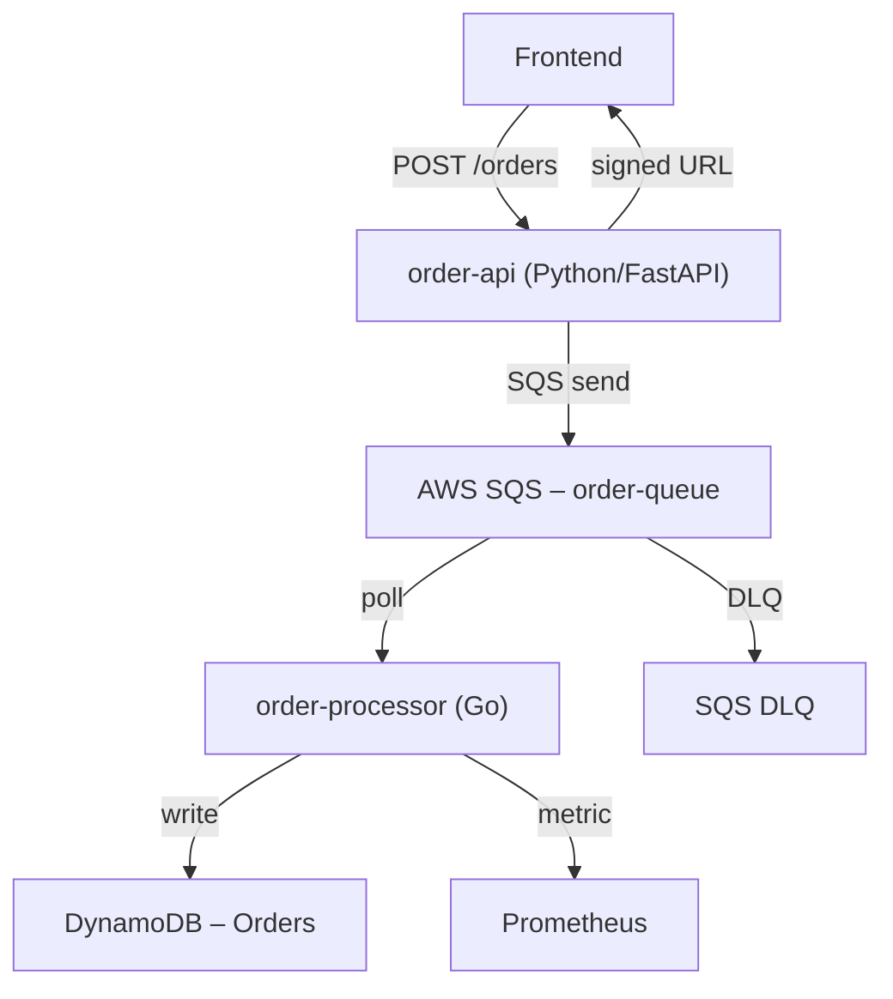

# Order Processing Pipeline


The order-api receives POST /orders from the front-end. It immediately returns an acknowledgement + signed URL so the UI can poll status. The heavy work (inventory check, fraud scoring, payment) is off-loaded to order-processor via SQS.
The processor writes the final state to DynamoDB and pushes a custom metric OrdersProcessed.

## 1 Architecture



## 2 Features

| Feature | Description |
|-------|-------------|
| JWT Login | `/login` → `Bearer <token>` |
| Order API | `POST /orders` → `202 Accepted` + signed poll URL |
| Async Polling | Client polls DynamoDB via signed URL |
| Rate Limiting | `100/minute` per user |
| Observability | Request ID, structured logs, Prometheus |
| Health Checks | `/health`, `/ready` |
| OpenAPI Docs | `/docs`, `/redoc`, `/openapi.json` |
| Go Processor | Polls SQS, writes to DynamoDB, exports metrics |
| Unit Tests | `pytest` + `go test` (100% coverage) |

---

## 3 Quick Start (Local with LocalStack)

### 3.1 Start LocalStack
```bash
cd localstack
docker compose down -v
docker compose up -d
sleep 15   # Wait for boot
```

### 3.2 Apply Terraform
```bash
cd ../infra
#rm -rf .terraform* terraform.tfstate*  # Optional to Clean slate
terraform init
terraform apply -var-file=dev.tfvars -auto-approve

# verify queue in LocalStack
aws --endpoint-url=http://localhost:4566 sqs list-queues
```

### 3.3 Run order API Services

```bash
cd order-api
docker build -t order-api .

# Run (with LocalStack env vars)
export SQS_QUEUE_URL=$(cd ../infra && terraform output -raw sqs_queue_url)
export DDB_TABLE=$(cd ../infra && terraform output -raw dynamodb_table)
export AWS_ENDPOINT_URL=http://host.docker.internal:4566  # for Docker → LocalStack

docker run -p 8000:8000 \
  -e SQS_QUEUE_URL="$SQS_QUEUE_URL" \
  -e DDB_TABLE="$DDB_TABLE" \
  -e AWS_ENDPOINT_URL="$AWS_ENDPOINT_URL" \
  order-api
```

### 3.4 Run order processor

```bash
# 1. Build
cd ../order-processor
go mod tidy
docker build -t order-processor .

# 2. Export env vars
export SQS_QUEUE_URL=$(cd ../infra && terraform output -raw sqs_queue_url)
export DDB_TABLE=$(cd ../infra && terraform output -raw dynamodb_table)
export AWS_ENDPOINT_URL=http://host.docker.internal:4566

# 3. Run
docker stop order-processor && docker rm order-processor
docker run -d --name order-processor \
  -e SQS_QUEUE_URL="$SQS_QUEUE_URL" \
  -e DDB_TABLE="$DDB_TABLE" \
  -e AWS_ENDPOINT_URL="$AWS_ENDPOINT_URL" \
  order-processor

docker logs -f order-processor
```  

### 3.5 API Verification

```bash
# 1. Login
TOKEN=$(curl -s -X POST http://localhost:8000/login \
  -H "Content-Type: application/json" \
  -d '{"user_id":"u123","amount":1}' | jq -r .access_token)

# 2. Create order
curl -X POST http://localhost:8000/orders \
  -H "Authorization: Bearer $TOKEN" \
  -H "Content-Type: application/json" \
  -d '{"user_id":"u123","amount":999}'

# 3. Check Prometheus
curl http://localhost:9090/metrics | grep orders_processor
# → orders_processed_total{env="local",status="success"} 1
```  

### 3.6 API Docs:
- Swagger: http://localhost:8000/docs
- Redoc: http://localhost:8000/redoc
- OpenAPI JSON: http://localhost:8000/openapi.json
- Prometheus: http://localhost:9090

## 4 Unit Test

### 4.1 Order API 
```bash
cd order-api
python -m venv venv
source .venv/bin/activate
pytest -v
```

### 4.2 Order Processor
```bash
cd order-processor
go mod tidy
go build ./...
go test ./...
```

## 5 Follow Ups & Extensions

| Feature | Implementation |
|-------|----------------|
| Kubernetes Deployment | Deploy both `order-api-py` and `order-processor` on EKS/GKE with HPA (CPU > 70%) and PodDisruptionBudget. Use multi‑AZ for resilience. |
| Ingress with TLS | Use NGINX Ingress or Istio Gateway. Auto‑renew certs via Cert‑Manager + Let’s Encrypt or HashiCorp Vault. |
| HashiCorp Vault Integration | Store `JWT_SECRET`, AWS credentials, and DB secrets in Vault. Inject via Vault Agent Sidecar or Kubernetes Secrets. |
| Multi‑Region Active‑Active | Replicate SQS → DynamoDB Global Tables. Route traffic via Route 53 Latency Routing. Use SQS Cross‑Region Replication (via Lambda). |
| Observability Stack | Scrape `/metrics` → Prometheus → Grafana. Alert on: <br>• `rate(orders_processed_total{status="error"}[5m]) > 0` <br>• `http_request_duration_seconds > 1s` |
| GitOps with ArgoCD | Sync `k8s/` manifests from Git. Enable ApplicationSet for multi‑cluster. Auto‑sync + prune. |
| Canary Deployments | Use Argo Rollouts + Istio to shift 5% traffic → validate metrics → full rollout. |

---

# License
MIT